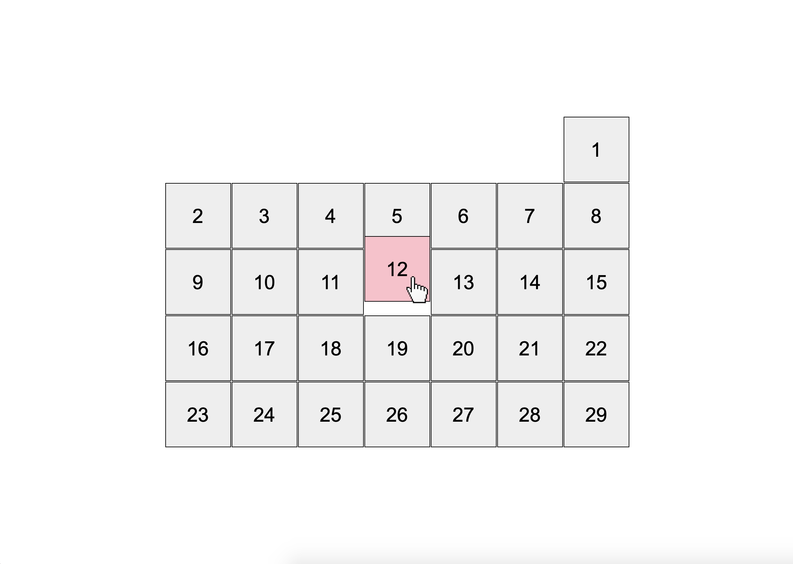

# Calendar
- [DEMO LINK](https://nazarbaraban.github.io/layout_calendar/)

Created a calendar in the middle of the screen using SCSS and following BEM methodology. The calendar has 31 days, each represented as a grey square with numbers generated using CSS. It uses flex layout with proper variables, modifiers for the start day and month length, and hover effects that change the cursor and color while moving the cell up slightly with animation on hover.

## Here is a preview:
.
